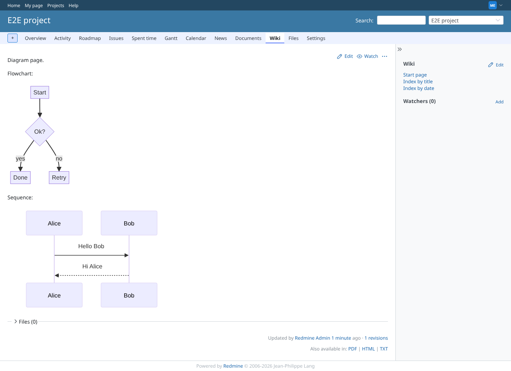
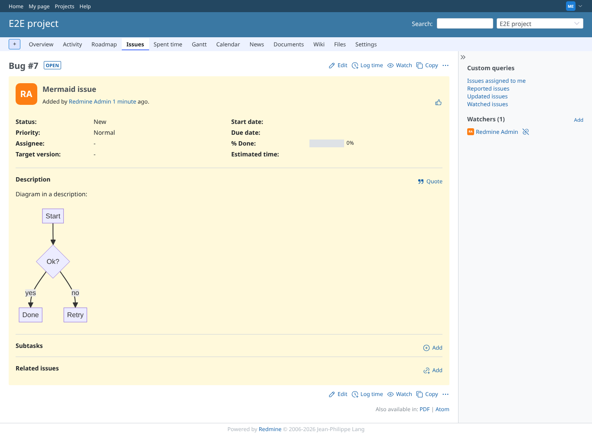
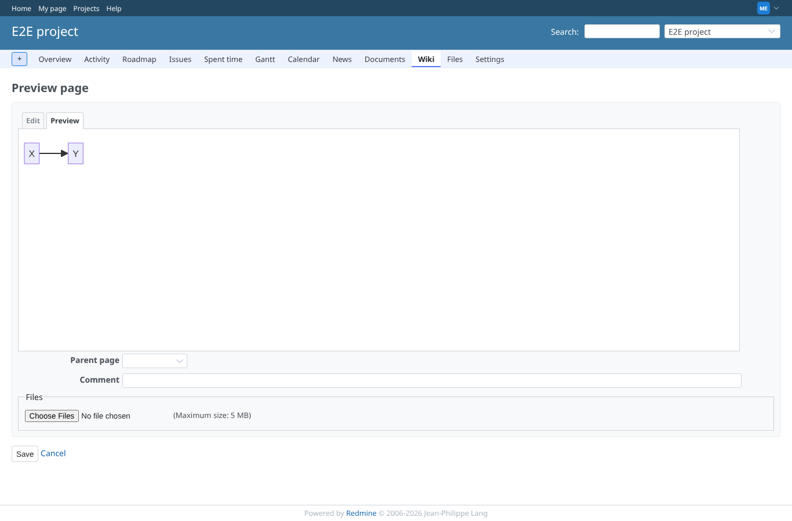
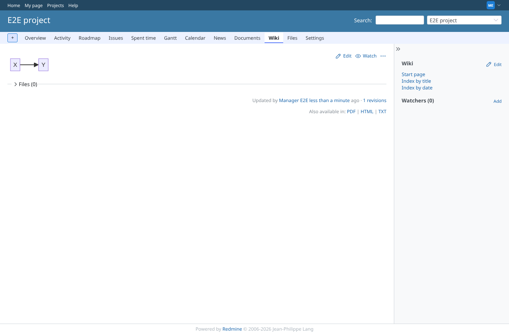
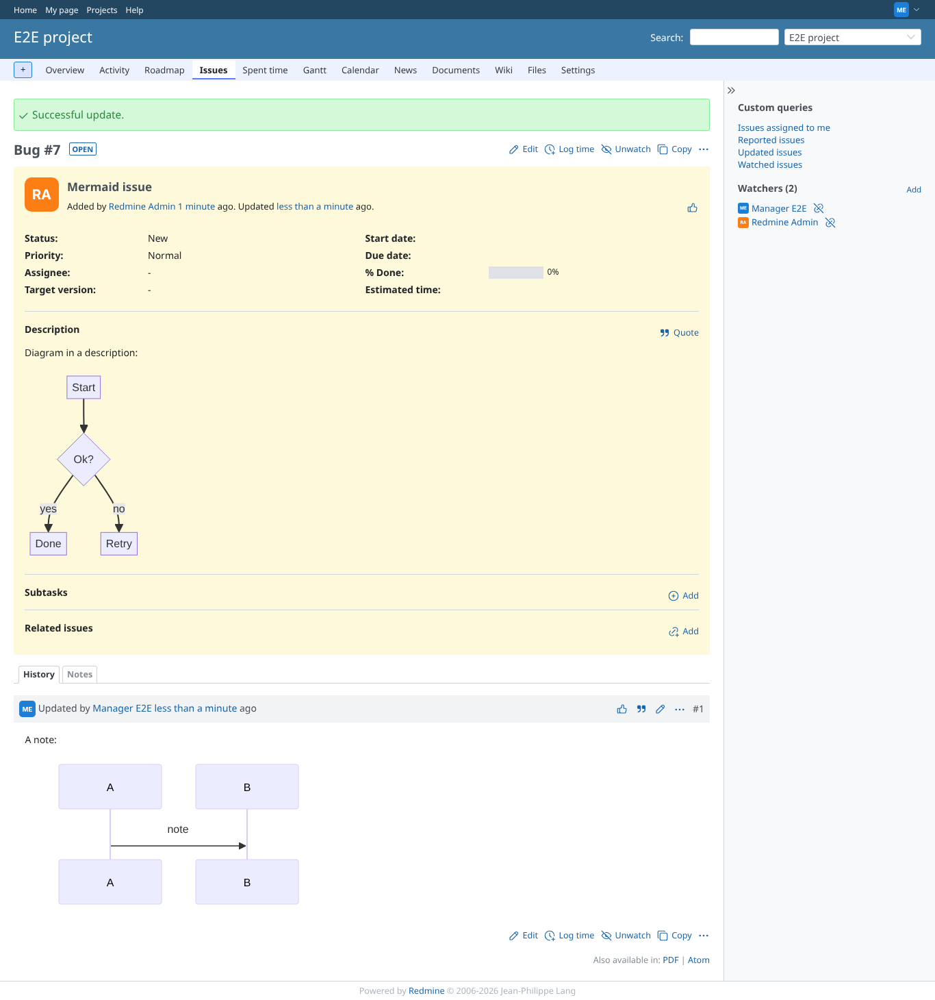
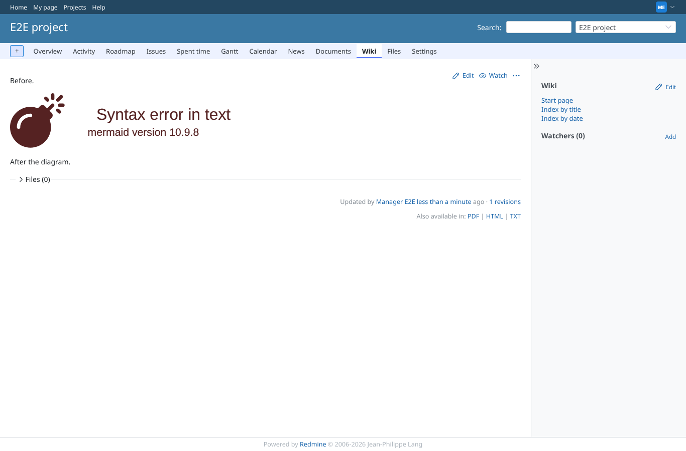
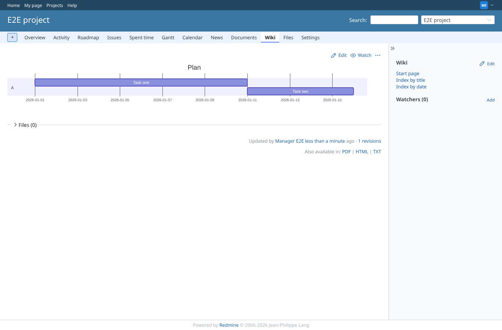
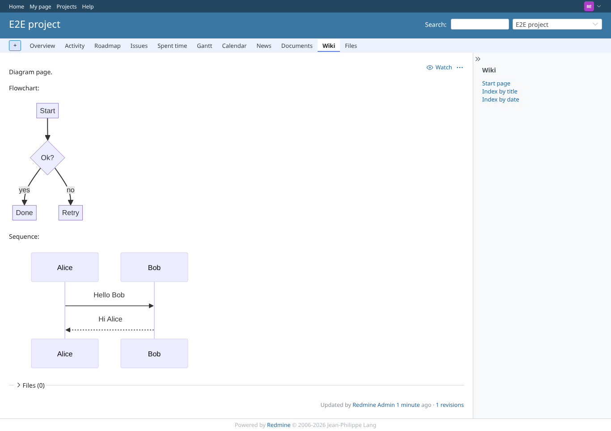
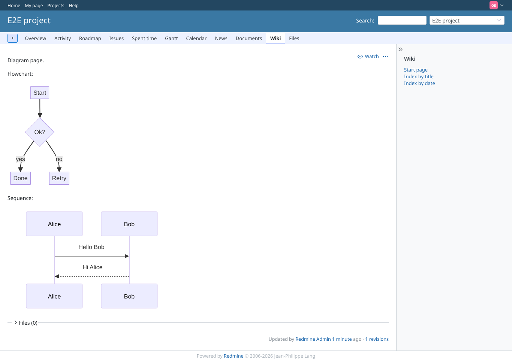

# mermaid-macro

Run 2026-10-06T20:23:55.530Z against http://127.0.0.1:3000.

| screenshot | user | URL | shows |
|---|---|---|---|
|  | manager | `/projects/e2e-project/wiki/Diagrams` | A wiki page with a flowchart and a sequence diagram, both rendered as SVG |
|  | manager | `/issues/7` | The diagram in an issue description is rendered |
|  | manager | `/projects/e2e-project/wiki/Preview_page/edit` | The Preview tab of the wiki editor renders the diagram |
|  | manager | `/projects/e2e-project/wiki/Preview_page` | The saved page renders the diagram |
|  | manager | `/issues/7` | A diagram in an issue note is rendered in the history |
|  | manager | `/projects/e2e-project/wiki/Broken` | An invalid diagram shows mermaid's own error, the surrounding text is intact |
|  | manager | `/projects/e2e-project/wiki/Gantt` | A gantt diagram; its the plugin stylesheet rule for task bars is loaded |
|  | reporter | `/projects/e2e-project/wiki/Diagrams` | A member without plugin permissions sees the diagrams |
|  | outsider | `/projects/e2e-project/wiki/Diagrams` | A non-member sees the diagrams of a public project |
|  | outsider | `/projects/e2e-private/wiki/Diagrams` | The private project's diagram page is refused for a non-member |
