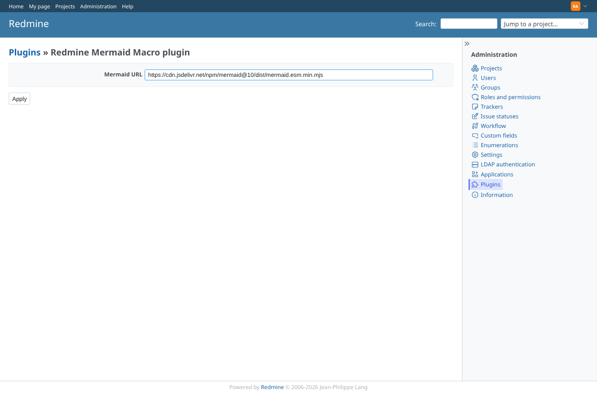
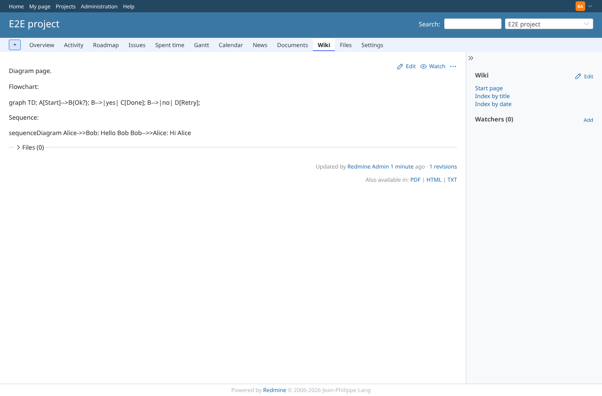
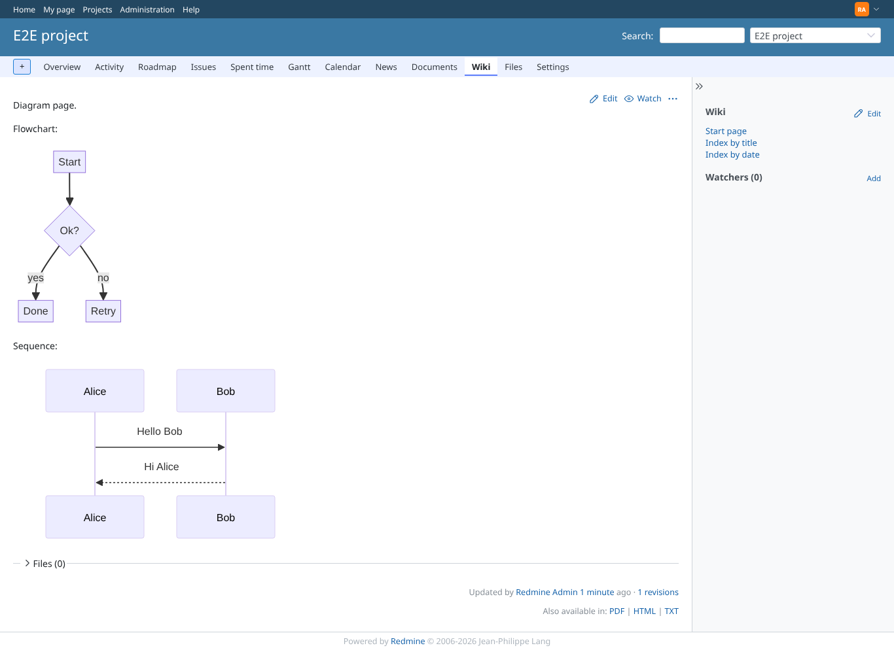
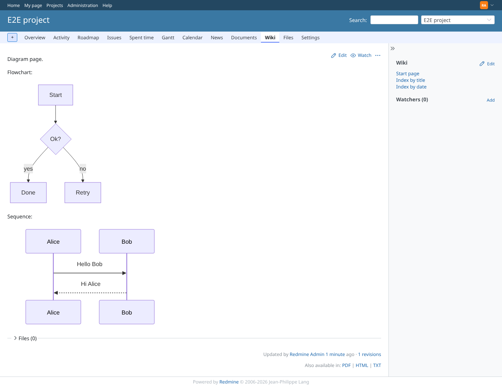
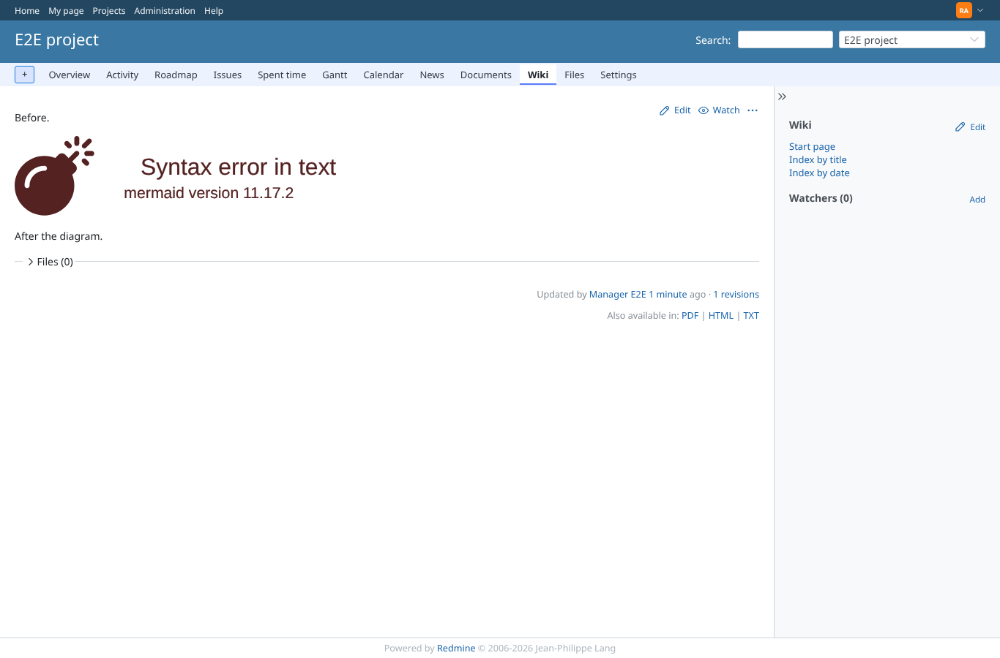
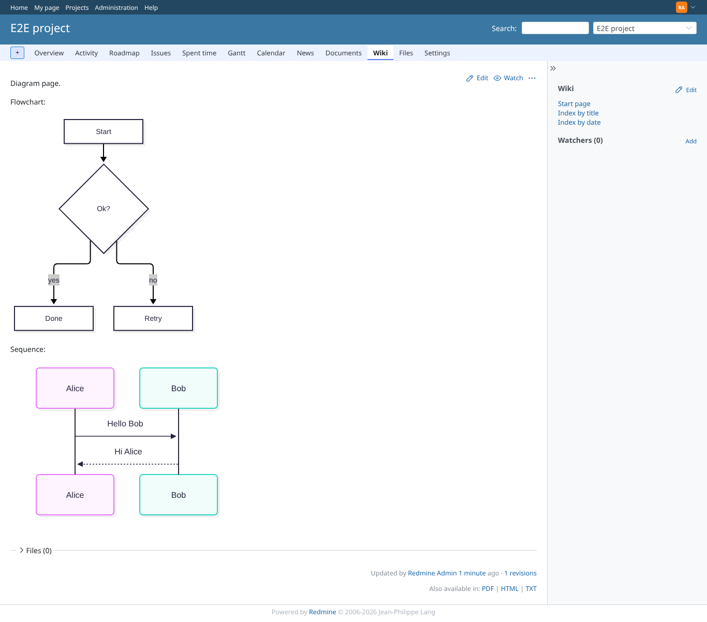
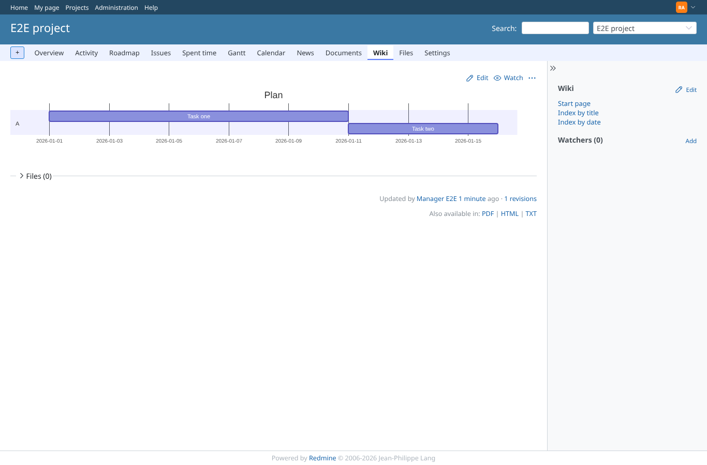
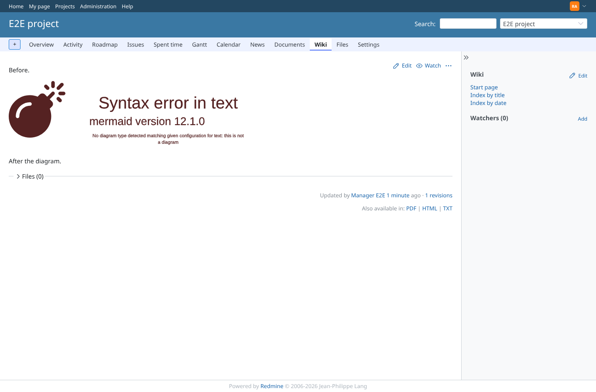
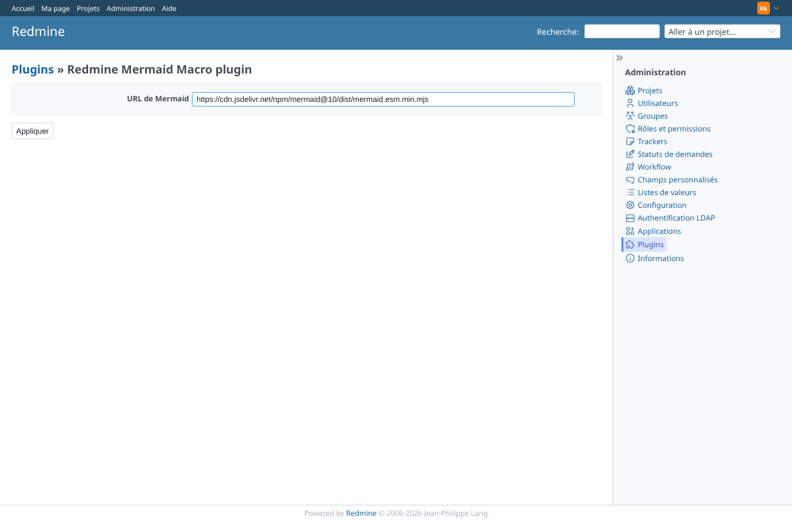
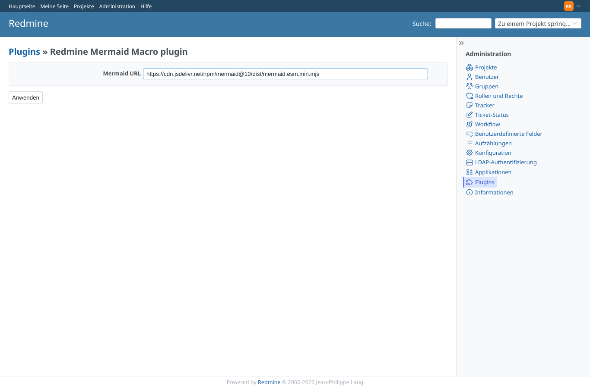

# settings

Run 2026-10-06T20:24:51.228Z against http://127.0.0.1:3000.

| screenshot | user | URL | shows |
|---|---|---|---|
|  | admin | `/settings/plugin/redmine_mermaid_macro` | The plugin configuration form shows the default jsDelivr URL |
|  | admin | `/projects/e2e-project/wiki/Diagrams` | With a URL that does not exist no diagram is drawn; the source stays as plain text and the page works |
|  | admin | `/projects/e2e-project/wiki/Diagrams` | A blank URL falls back to the default: the diagrams render again |
|  | admin | `/projects/e2e-project/wiki/Diagrams` | With the mermaid@11 URL both diagrams render  |
|  | admin | `/projects/e2e-project/wiki/Gantt` | A gantt diagram with mermaid 11 |
|  | admin | `/projects/e2e-project/wiki/Broken` | An invalid diagram with mermaid 11: error shown by mermaid 11.17.2, page intact |
|  | admin | `/projects/e2e-project/wiki/Diagrams` | With the mermaid@12 URL both diagrams render  |
|  | admin | `/projects/e2e-project/wiki/Gantt` | A gantt diagram with mermaid 12 |
|  | admin | `/projects/e2e-project/wiki/Broken` | An invalid diagram with mermaid 12: error shown by mermaid 12.1.0, page intact |
|  | admin | `/settings/plugin/redmine_mermaid_macro` | The original URL is stored again |
|  | admin | `/settings/plugin/redmine_mermaid_macro` | The setting label in language nl: Mermaid-URL |
|  | admin | `/settings/plugin/redmine_mermaid_macro` | The setting label in language fr: URL de Mermaid |
|  | admin | `/settings/plugin/redmine_mermaid_macro` | The setting label in language de: Mermaid URL (falls back to English, not shipped) |
|  | manager | `/settings/plugin/redmine_mermaid_macro` | manager cannot open the plugin configuration |
|  | reporter | `/settings/plugin/redmine_mermaid_macro` | reporter cannot open the plugin configuration |
|  | outsider | `/settings/plugin/redmine_mermaid_macro` | outsider cannot open the plugin configuration |
